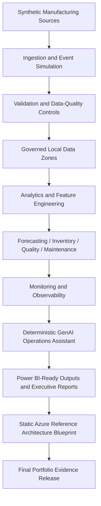

# Azure Manufacturing Intelligence Platform

## Executive overview

This repository is a complete local-first, Azure-mapped manufacturing operations and supply-chain intelligence portfolio. It shows how an enterprise manufacturer could ingest synthetic factory and supply-chain data, govern it, validate it, model it, expose analytics-ready outputs, document Azure reference architecture, and consolidate release evidence without requiring live cloud resources.

## Business problem

Manufacturing organisations often make decisions from fragmented production, inventory, quality, equipment, warehouse, supplier, and demand data. That fragmentation makes it harder to identify constraints, anticipate shortages, manage supplier risk, protect quality, and prioritise operational interventions.

## Platform objectives

- Build deterministic synthetic data pipelines for manufacturing and supply-chain domains.
- Establish governed local data zones that map conceptually to Azure services.
- Support forecasting, inventory intelligence, quality analytics, predictive maintenance, monitoring, and future GenAI assistance and reporting.
- Keep every milestone reproducible, testable, auditable, and CI-ready.

## Core capabilities

Implemented local capabilities include production telemetry ingestion, schema validation, demand forecasting, inventory-risk scoring, quality anomaly detection, predictive maintenance, local evidence monitoring, a deterministic local GenAI-style operations assistant, Power BI-ready dashboard output tables, a static Azure reference architecture blueprint, and a final release evidence catalogue.

## Intended users

The platform is intended for plant managers, production supervisors, maintenance engineers, quality managers, supply-chain planners, inventory analysts, procurement teams, operations analysts, data scientists, ML engineers, and executive leadership.

Example decisions include whether production is meeting plan, where throughput is constrained, which products may face shortages, which suppliers introduce operational risk, which batches show quality deterioration, and which machines should be inspected.

## Data domains

Synthetic raw sources now cover production operations, inventory, sales and demand, quality checks, equipment health, warehouse movements, and supplier performance. All data is synthetic and must not represent real individuals, employees, customers, suppliers, or commercially sensitive operations.

## Local-first approach

Local directories, Python modules, configuration files, tests, and run manifests will emulate the responsibilities of a cloud analytics estate. This keeps development affordable, deterministic, offline-friendly, and easy to demonstrate in interviews while preserving a clear path to Azure implementation.

## Azure reference mapping

| Local capability | Azure reference service |
| --- | --- |
| JSONL and CSV event simulation | Azure Event Hubs and Azure IoT Hub |
| Local raw-data directories | Azure Data Lake Storage Gen2 |
| Python streaming simulator | Azure Stream Analytics |
| Local telemetry analysis | Azure Data Explorer |
| Local analytical outputs | Azure Synapse Analytics |
| Local model training | Azure Machine Learning |
| Local GenAI adapter | Azure AI Foundry |
| Local dashboard extracts | Microsoft Power BI |
| Static architecture blueprint | Bicep, Terraform, Azure landing-zone guidance |
| Final release evidence catalogues | Portfolio release governance and validation evidence |
| Local lineage metadata | Microsoft Purview |
| Local structured logs and metrics | Azure Monitor and Application Insights |
| GitHub Actions | Azure DevOps Pipelines or GitHub Actions for Azure |

These mappings are architectural references only. No Azure resource IDs, endpoints, credentials, deployments, screenshots, or cloud success claims are created by the completed local milestones.

## High-level architecture



See [diagrams/high-level-platform-architecture.mmd](diagrams/high-level-platform-architecture.mmd) and [docs/architecture/architecture-overview.md](docs/architecture/architecture-overview.md) for more detail.

## Repository structure

```text
configs/       Base and environment configuration
data/          Local raw, interim, and processed data zones
diagrams/      Mermaid architecture diagrams
docs/          Architecture, business, engineering, milestone, and roadmap docs
outputs/       Analytics, monitoring, dashboard, and architecture evidence
reports/       Generated narrative, dashboard, and architecture reports
infra/         Reference-only Bicep, Terraform, policy, and runbook blueprints
scripts/       Repository validation utilities
src/           Python package scaffold and shared utilities
tests/         Unit tests and deterministic fixture guidance
```

## Milestone roadmap

| Milestone | Status |
| --- | --- |
| Milestone 1 - Repository foundation and architecture | Complete |
| Milestone 2 - Deterministic synthetic manufacturing datasets | Complete |
| Milestone 3 - Governed ingestion and data validation | Complete |
| Milestone 4 - Demand forecasting and forecast evaluation | Complete |
| Milestone 5 - Inventory intelligence and optimisation | Complete |
| Milestone 6 - Quality analytics and anomaly detection | Complete |
| Milestone 7 - Predictive maintenance and equipment failure risk | Complete |
| Milestone 8 - Monitoring and observability | Complete |
| Milestone 9 - GenAI operations assistant | Complete |
| Milestone 10 - Dashboard outputs and Power BI-ready reporting | Complete |
| Milestone 11 - Azure reference architecture and infrastructure blueprint | Complete |
| Milestone 12 - Final portfolio polish and release readiness | Complete |

Full roadmap: [docs/roadmap.md](docs/roadmap.md).

## Current implementation status

Implemented through Milestone 12:

- Repository scaffold and package boundaries.
- Configuration loading with base, local, CI, and environment-variable overrides.
- Project-root path resolution independent of current working directory.
- Standard-library structured logging foundation.
- Exception hierarchy for future pipelines.
- Documentation, diagrams, tests, CI workflow, and structure validation.
- Deterministic synthetic data generation for seven raw manufacturing and supply-chain domains.
- Schema metadata, generation manifest, and generation summary for the synthetic raw files.
- Separate local and CI synthetic-data profiles.
- Existing-run validation for generated data without regenerating it.
- Governed local ingestion from `data/raw/` to `data/interim/accepted/` and `data/interim/quarantine/`.
- Strict and permissive ingestion modes.
- Source hash verification, schema checks, domain validation, duplicate detection, and cross-dataset relationship checks.
- Ingestion manifests, validation summaries, quarantine summaries, lineage records, and data-quality reports.
- Governed demand forecasting from accepted sales orders.
- Leakage-safe daily demand aggregation, lag features, chronological splits, rolling-origin backtests, model comparison, held-out test metrics, prediction intervals, forecast manifests, and forecast lineage.
- Governed inventory intelligence from accepted inventory, supplier, warehouse-movement, sales, and forecast evidence.
- Deterministic warehouse demand allocation, supplier-risk metrics, inventory policy inputs, inventory position, safety-stock, reorder-point, reorder-quantity, excess-stock, expiry-risk, working-capital, prioritised-action, constrained-allocation, scenario-result, manifest, lineage, diagnostics, and report outputs.
- Governed quality analytics from accepted quality checks and production events.
- Deterministic specification compliance, KPI/yield proxies, defect Pareto, capability diagnostics, expanding control-chart baselines, SPC rules, robust z-score, Isolation Forest diagnostics, quality-risk scoring, alert outputs, manifests, lineage, diagnostics, and reports.
- Governed predictive maintenance from accepted equipment health, accepted production events, and optional quality context.
- Deterministic sensor-threshold compliance, runtime/service proxies, chronological degradation indicators, robust z-score, deterministic Isolation Forest diagnostics, failure-risk scoring, equipment-health scoring, maintenance alerts, machine and sensor summaries, manifest, lineage, diagnostics, portfolio prediction JSON, and reports.
- Governed local monitoring from tracked generation, ingestion, forecast, inventory, quality, and maintenance evidence.
- Deterministic manifest integrity checks, lineage completeness checks, data-quality monitoring, model and analytics monitoring, domain health scores, platform health summary, monitoring alerts, manifest, lineage, diagnostics, portfolio health JSON, and observability reports.
- Deterministic local GenAI-style operations assistant from tracked governed evidence.
- Evidence catalogue, deterministic retrieval, prompt-template rendering, guardrails, response synthesis, evaluation, diagnostics, manifest, lineage, assistant interaction evidence, executive brief, supply-chain summary, and manufacturing operations report.
- Local Power BI-ready dashboard output layer from governed tracked evidence.
- Dashboard dimensions, fact tables, executive scorecard, metric catalogue, semantic model metadata, page specifications, visual specifications, diagnostics, manifest, lineage, dashboard reports, and portfolio dashboard documentation.
- Static Azure reference architecture and infrastructure blueprint layer from governed tracked evidence.
- Azure service mapping, security controls matrix, data architecture layers, MLOps mapping, GenAI architecture mapping, operations mapping, cost considerations, ADRs, validation results, architecture manifest, architecture lineage, architecture reports, Mermaid diagrams, and reference-only Bicep and Terraform files.
- Final release evidence consolidation from all tracked milestone outputs.
- Final evidence index, report index, architecture index, data catalogue, model and analytics catalogue, dashboard catalogue, GenAI catalogue, Azure reference catalogue, validation summary, repository health, release diagnostics, manifest, lineage, release docs, and interview/CV/recruiter reports.

Not implemented: live Azure integration, live Power BI/Fabric publishing, OpenAI or Azure OpenAI calls, production orchestration, or any Milestone 13 scope.

## Development setup

```bash
python -m venv .venv
source .venv/bin/activate
make install
```

The package supports Python 3.11 or newer.

## Quality commands

```bash
make structure-check
make format
make lint
make type-check
make test
make generate-data
make generate-data-ci
make validate-generation
make ingest
make ingest-ci
make validate-ingestion
make forecast
make forecast-ci
make prepare-forecast-data
make validate-forecast
make inventory
make inventory-ci
make validate-inventory
make quality-analytics
make quality-analytics-ci
make validate-quality-analytics
make maintenance
make maintenance-ci
make validate-maintenance
make monitoring
make monitoring-ci
make validate-monitoring
make genai
make genai-ci
make validate-genai
make dashboard
make dashboard-ci
make validate-dashboard
make architecture
make architecture-ci
make validate-architecture
make release
make release-ci
make validate-release
make validate-all
make quality
```

`make generate-data` regenerates the intentionally tracked local sample under `data/raw/` using `configs/synthetic_data.yaml` and an explicit overwrite flag. Direct CLI generation refuses to overwrite existing managed files unless `--overwrite` is passed. `make generate-data-ci` uses the smaller `configs/synthetic_data_ci.yaml` profile and writes to ignored `.generated/ci/raw/`. `make validate-generation` validates the existing `data/raw/` run without regenerating it.

`make ingest` validates the tracked synthetic raw sample and writes governed local outputs under `data/interim/`. `make ingest-ci` uses ignored `.generated/ci/interim/` outputs for CI. `make validate-ingestion` validates the existing local interim run without regenerating it.

`make forecast` builds controlled forecast evidence under `outputs/forecasting/`, `outputs/demand_forecast.csv`, and `reports/demand_forecasting_report.md`. `make prepare-forecast-data` creates the longer governed forecasting profile under ignored `.generated/forecasting/` and fails on unexpected sales-order quarantine. `make forecast-ci` writes ignored CI forecast outputs. `make validate-forecast` verifies an existing forecast run without retraining.

Forecasting uses `ordered_quantity` at the `product_id` plus `distribution_region` grain. The selected controlled-run model is `random_forest`, chosen from validation WAPE only; held-out test metrics are reported separately. Prediction intervals use deterministic empirical residual bands.

`make inventory` reads governed accepted inventory, supplier, warehouse-movement, sales, and forecast evidence; writes `outputs/inventory_scores.csv`, warehouse demand allocation, supplier risk, policy input, inventory position, recommendation, scenario, diagnostics, manifest, and lineage artifacts under `outputs/inventory/`; writes `reports/inventory_intelligence_report.md` and `reports/inventory_scenario_summary.md`; and records upstream hashes without mutating governed inputs. `make inventory-ci` writes the same shape under ignored `.generated/ci/`. `make validate-inventory` verifies an existing inventory run without rescoring.

`make quality-analytics` reads governed accepted quality checks and production events; writes `outputs/quality_alerts.csv`, detailed quality observations, KPIs, Pareto, capability, control-chart, SPC, anomaly, risk, diagnostics, manifest, and lineage artifacts under `outputs/quality/`; writes `reports/quality_analytics_report.md` and `reports/quality_alert_summary.md`; and records upstream hashes without mutating governed inputs. The controlled run processes 168 inspections, finds 26 specification failures, 5 near-limit observations, 7 SPC signals, 2 robust-z anomalies, 12 Isolation Forest anomalies, and 38 alerts. `make quality-analytics-ci` writes the same shape under ignored `.generated/ci/`. `make validate-quality-analytics` verifies an existing quality run without rescoring.

`make maintenance` reads governed accepted equipment-health and production-event data plus optional governed quality context; writes `outputs/maintenance_predictions.json`, equipment features, scores, alerts, machine and sensor summaries, degradation signals, anomaly scores, risk summary, diagnostics, manifest, and lineage under `outputs/maintenance/`; writes `reports/maintenance_analytics_report.md` and `reports/maintenance_alert_summary.md`; and records upstream hashes without mutating governed inputs. The controlled run processes 504 equipment records, finds 60 warning breaches, 9 critical breaches, 59 degradation signals, 0 robust-z anomalies, 0 Isolation Forest anomalies, and 135 maintenance alerts. `make maintenance-ci` writes the same shape under ignored `.generated/ci/`. `make validate-maintenance` verifies an existing maintenance run without rescoring.

`make monitoring` reads tracked governed evidence from generation, ingestion, forecasting, inventory, quality, and maintenance; writes `outputs/platform_health_summary.json`, domain health scores, pipeline health, data-quality monitoring, model and analytics monitoring, evidence integrity checks, lineage completeness, alerts, diagnostics, manifest, and lineage under `outputs/monitoring/`; writes `reports/platform_monitoring_report.md` and `reports/observability_summary.md`; and records upstream hashes without mutating governed evidence. The controlled run scores platform health at 98.666667, with manifest integrity 100, lineage completeness 100, and one informational monitoring alert. `make monitoring-ci` writes the same shape under ignored `.generated/ci/`. `make validate-monitoring` verifies an existing monitoring run without recalculating.

`make genai` reads tracked governed evidence from generation, ingestion, forecasting, inventory, quality, maintenance, and monitoring; writes the deterministic evidence catalogue, retrieval results, prompt templates, rendered prompts, assistant responses, guardrail decisions, evaluation, diagnostics, manifest, and lineage under `outputs/genai/`; writes `reports/genai_operations_assistant_report.md`, `reports/genai_guardrails_report.md`, `reports/executive_manufacturing_brief.md`, `reports/supply_chain_summary.md`, and `reports/manufacturing_operations_report.md`; and records upstream hashes without mutating governed evidence. The controlled run ID is `GENAI-56556548ec78b651`, with 27 evidence items, 8 assistant responses, 16 guardrail results, grounding score 1.000000, citation coverage 1.000000, zero unsupported claims, and `external_model_called=false`. `make genai-ci` writes the same shape under ignored `.generated/ci/genai/`. `make validate-genai` verifies an existing GenAI run without recalculating responses.

`make dashboard` reads governed tracked ingestion, forecasting, inventory, quality, maintenance, monitoring, and GenAI evidence; writes 10 dimension tables, 7 fact tables, an executive scorecard, metric catalogue, semantic model metadata, page specs, visual specs, diagnostics, manifest, and lineage under `outputs/dashboard/`; writes `reports/dashboard_output_report.md`, `reports/semantic_model_summary.md`, and portfolio docs under `dashboard/`; and records upstream hashes without mutating governed evidence. The controlled run ID is `DASHBOARD-f32c9d5a9c8a5914`, with 19 dashboard tables, 13 metrics, 8 pages, 48 visual specs, and 14 executive scorecard KPIs. `make dashboard-ci` writes the same shape under ignored `.generated/ci/dashboard/`. `make validate-dashboard` verifies an existing dashboard run without recalculating outputs.

`make architecture` reads governed tracked ingestion, forecasting, inventory, quality, maintenance, monitoring, GenAI, and dashboard evidence; writes static Azure service mapping, security controls, data architecture, MLOps, GenAI, operations, cost, ADR, validation, manifest, and lineage outputs under `outputs/architecture/`; writes `reports/azure_architecture_report.md` and `reports/deployment_boundary_report.md`; creates reference-only docs under `docs/architecture/`, diagrams under `diagrams/`, and Bicep/Terraform/policy/runbook blueprints under `infra/`; and records upstream hashes without mutating governed evidence. The controlled run ID is `ARCH-415f3e814fd4aac6`, with 15 service mappings, 9 security controls, and 11 ADRs. `make architecture-ci` writes the same shape under ignored `.generated/ci/architecture/`. `make validate-architecture` verifies an existing architecture run without regenerating outputs.

`make release` consolidates tracked evidence from Milestones 1-11 into final portfolio catalogues under `outputs/release/`; writes final release, validation, evidence, interview, CV, and recruiter reports under `reports/`; writes final release documentation under `docs/release/`; and records release manifest and lineage without mutating upstream milestone evidence. The controlled run ID is `REL-de43cd61b28d2282`, with 323 evidence rows, 26 report rows, and 8 catalogues. `make release-ci` writes the same shape under ignored `.generated/ci/release/`. `make validate-release` validates an existing release run, and `make validate-all` runs every milestone validator from generation through release.

## Testing approach

Current tests verify configuration loading, environment overrides, path resolution, repository structure, package imports, project metadata, Azure reference-only safety, deterministic synthetic generation, schema headers, row counts, manifests, cross-dataset entity consistency, governed ingestion, data-quality validation, quarantine behavior, lineage evidence, governed forecasting, inventory intelligence, governed quality analytics, governed maintenance analytics, governed monitoring, deterministic GenAI evidence retrieval, prompt rendering, guardrails, response synthesis, evaluation, dashboard dimensions and facts, semantic model metadata, page and visual specs, metric catalogue, architecture service mapping, security controls, data/MLOps/GenAI/operations/cost mappings, ADRs, release evidence catalogues, release manifest and lineage, no-deploy boundaries, overwrite behavior, tamper detection, and CLI execution outside the repository root.

## Security, privacy, and synthetic data

This repository is synthetic-data only. Do not commit credentials, `.env` files, real employee data, customer data, supplier data, commercial production details, or private operational records. Future cloud deployments should use least privilege, managed identities, Key Vault, immutable raw-data conventions, lineage metadata, retention principles, and accepted-versus-quarantined data separation.

## Generated-data tracking policy

The small deterministic `data/raw/` sample, governed `data/interim/` validation evidence, and controlled forecast, inventory, quality, maintenance, monitoring, GenAI assistant, dashboard, architecture, and release outputs are intentionally tracked as portfolio evidence. Larger, ad hoc, CI, and temporary generated runs must stay out of Git; `.generated/` is ignored for that purpose. No prompt logs containing secrets, real LLM outputs, `.pbix` files, real Power BI exports, Terraform state, Terraform plan files, `.terraform/` directories, or deployment credentials should be committed. Generation timestamps and analytical run IDs are derived from stable configuration and input hashes, so controlled runs remain reproducible.

## Known limitations

Milestone 12 release outputs are local portfolio artefacts, not production deployment evidence. The repository does not generate `.pbix` files, call Power BI or Fabric APIs, call OpenAI or Azure OpenAI, create cloud refresh schedules, create Azure resources, require Azure credentials, run Terraform apply, or run Bicep deployment commands.

## Planned portfolio outputs

Current portfolio outputs include `outputs/demand_forecast.csv`, `outputs/inventory_scores.csv`, `outputs/quality_alerts.csv`, `outputs/maintenance_predictions.json`, `outputs/platform_health_summary.json`, GenAI narrative reports under `reports/`, Power BI-ready dashboard tables under `outputs/dashboard/`, Azure reference architecture evidence under `outputs/architecture/`, and final release catalogues under `outputs/release/`.

## Recruiter and Interview Highlights

- End-to-end manufacturing intelligence platform spanning data engineering, analytics, ML-style scoring, monitoring, dashboard-ready modelling, GenAI-style assistance, and Azure architecture.
- Evidence-backed implementation with deterministic outputs, manifests, lineage, CI, tests, and validation commands.
- Clear production boundary: local synthetic portfolio evidence today; Azure services are mapped as reference architecture for a future deployment.

## Disclaimer

Azure services are represented through architecture mappings and local adapters unless a later milestone explicitly implements deployment guidance. The completed local milestones do not deploy, call, or require Azure resources.
