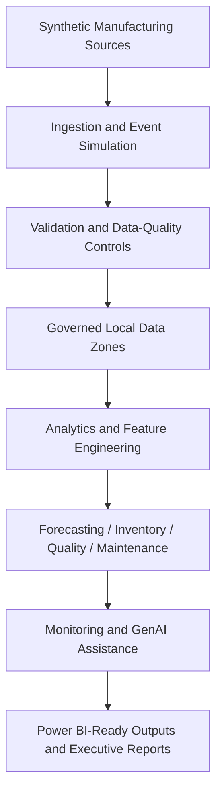

# Azure Manufacturing Intelligence Platform

## Executive overview

This repository is the foundation for a local-first, Azure-mapped manufacturing operations and supply-chain intelligence platform. It is designed to show how an enterprise manufacturer could ingest synthetic factory and supply-chain data, govern it, validate it, model it, and expose analytics-ready outputs without requiring live cloud resources during development.

## Business problem

Manufacturing organisations often make decisions from fragmented production, inventory, quality, equipment, warehouse, supplier, and demand data. That fragmentation makes it harder to identify constraints, anticipate shortages, manage supplier risk, protect quality, and prioritise operational interventions.

## Platform objectives

- Build deterministic synthetic data pipelines for manufacturing and supply-chain domains.
- Establish governed local data zones that map conceptually to Azure services.
- Support future forecasting, inventory intelligence, quality analytics, predictive maintenance, monitoring, GenAI assistance, and reporting.
- Keep every milestone reproducible, testable, auditable, and CI-ready.

## Core capabilities

Planned capabilities include production telemetry ingestion, schema validation, demand forecasting, inventory-risk scoring, supplier-performance analytics, quality anomaly detection, predictive maintenance, operational monitoring, scenario analysis, GenAI-assisted recommendations, and Power BI-ready extracts.

## Intended users

The platform is intended for plant managers, production supervisors, maintenance engineers, quality managers, supply-chain planners, inventory analysts, procurement teams, operations analysts, data scientists, ML engineers, and executive leadership.

Example decisions include whether production is meeting plan, where throughput is constrained, which products may face shortages, which suppliers introduce operational risk, which batches show quality deterioration, and which machines should be inspected.

## Data domains

Synthetic raw sources now cover production operations, inventory, sales and demand, quality checks, equipment health, warehouse movements, and supplier performance. All data is synthetic and must not represent real individuals, employees, customers, suppliers, or commercially sensitive operations.

## Local-first approach

Local directories, Python modules, configuration files, tests, and run manifests will emulate the responsibilities of a cloud analytics estate. This keeps development affordable, deterministic, offline-friendly, and easy to demonstrate in interviews while preserving a clear path to Azure implementation.

## Azure reference mapping

| Local capability | Azure reference service |
| --- | --- |
| JSONL and CSV event simulation | Azure Event Hubs and Azure IoT Hub |
| Local raw-data directories | Azure Data Lake Storage Gen2 |
| Python streaming simulator | Azure Stream Analytics |
| Local telemetry analysis | Azure Data Explorer |
| Local analytical outputs | Azure Synapse Analytics |
| Local model training | Azure Machine Learning |
| Local GenAI adapter | Azure AI Foundry |
| Local dashboard extracts | Microsoft Power BI |
| Local lineage metadata | Microsoft Purview |
| Local structured logs and metrics | Azure Monitor and Application Insights |
| GitHub Actions | Azure DevOps Pipelines or GitHub Actions for Azure |

These mappings are architectural references only. No Azure resource IDs, endpoints, credentials, deployments, screenshots, or cloud success claims are created by the completed local milestones.

## High-level architecture



See [diagrams/high-level-platform-architecture.mmd](diagrams/high-level-platform-architecture.mmd) and [docs/architecture/architecture-overview.md](docs/architecture/architecture-overview.md) for more detail.

## Repository structure

```text
configs/       Base and environment configuration
data/          Local raw, interim, and processed data zones
diagrams/      Mermaid architecture diagrams
docs/          Architecture, business, engineering, milestone, and roadmap docs
outputs/       Future analytics-ready outputs
reports/       Future generated narrative reports
scripts/       Repository validation utilities
src/           Python package scaffold and shared utilities
tests/         Unit tests and deterministic fixture guidance
```

## Milestone roadmap

| Milestone | Status |
| --- | --- |
| Milestone 1 - Repository foundation and architecture | Complete |
| Milestone 2 - Deterministic synthetic manufacturing datasets | Complete |
| Milestone 3 - Governed ingestion and data validation | Complete |
| Milestone 4 - Demand forecasting and forecast evaluation | Complete |
| Milestone 5 - Inventory intelligence and optimisation | Complete |
| Milestone 6 onward | Planned |

Full roadmap: [docs/roadmap.md](docs/roadmap.md).

## Current implementation status

Implemented through Milestone 5:

- Repository scaffold and package boundaries.
- Configuration loading with base, local, CI, and environment-variable overrides.
- Project-root path resolution independent of current working directory.
- Standard-library structured logging foundation.
- Exception hierarchy for future pipelines.
- Documentation, diagrams, tests, CI workflow, and structure validation.
- Deterministic synthetic data generation for seven raw manufacturing and supply-chain domains.
- Schema metadata, generation manifest, and generation summary for the synthetic raw files.
- Separate local and CI synthetic-data profiles.
- Existing-run validation for generated data without regenerating it.
- Governed local ingestion from `data/raw/` to `data/interim/accepted/` and `data/interim/quarantine/`.
- Strict and permissive ingestion modes.
- Source hash verification, schema checks, domain validation, duplicate detection, and cross-dataset relationship checks.
- Ingestion manifests, validation summaries, quarantine summaries, lineage records, and data-quality reports.
- Governed demand forecasting from accepted sales orders.
- Leakage-safe daily demand aggregation, lag features, chronological splits, rolling-origin backtests, model comparison, held-out test metrics, prediction intervals, forecast manifests, and forecast lineage.
- Governed inventory intelligence from accepted inventory, supplier, warehouse-movement, sales, and forecast evidence.
- Deterministic warehouse demand allocation, supplier-risk metrics, inventory policy inputs, inventory position, safety-stock, reorder-point, reorder-quantity, excess-stock, expiry-risk, working-capital, prioritised-action, constrained-allocation, scenario-result, manifest, lineage, diagnostics, and report outputs.

Not implemented yet: quality anomaly detection, predictive maintenance, GenAI, dashboards, or live Azure integration.

## Development setup

```bash
python -m venv .venv
source .venv/bin/activate
make install
```

The package supports Python 3.11 or newer.

## Quality commands

```bash
make structure-check
make format
make lint
make type-check
make test
make generate-data
make generate-data-ci
make validate-generation
make ingest
make ingest-ci
make validate-ingestion
make forecast
make forecast-ci
make prepare-forecast-data
make validate-forecast
make inventory
make inventory-ci
make validate-inventory
make quality
```

`make generate-data` regenerates the intentionally tracked local sample under `data/raw/` using `configs/synthetic_data.yaml` and an explicit overwrite flag. Direct CLI generation refuses to overwrite existing managed files unless `--overwrite` is passed. `make generate-data-ci` uses the smaller `configs/synthetic_data_ci.yaml` profile and writes to ignored `.generated/ci/raw/`. `make validate-generation` validates the existing `data/raw/` run without regenerating it.

`make ingest` validates the tracked synthetic raw sample and writes governed local outputs under `data/interim/`. `make ingest-ci` uses ignored `.generated/ci/interim/` outputs for CI. `make validate-ingestion` validates the existing local interim run without regenerating it.

`make forecast` builds controlled forecast evidence under `outputs/forecasting/`, `outputs/demand_forecast.csv`, and `reports/demand_forecasting_report.md`. `make prepare-forecast-data` creates the longer governed forecasting profile under ignored `.generated/forecasting/` and fails on unexpected sales-order quarantine. `make forecast-ci` writes ignored CI forecast outputs. `make validate-forecast` verifies an existing forecast run without retraining.

Forecasting uses `ordered_quantity` at the `product_id` plus `distribution_region` grain. The selected controlled-run model is `random_forest`, chosen from validation WAPE only; held-out test metrics are reported separately. Prediction intervals use deterministic empirical residual bands.

`make inventory` reads governed accepted inventory, supplier, warehouse-movement, sales, and forecast evidence; writes `outputs/inventory_scores.csv`, warehouse demand allocation, supplier risk, policy input, inventory position, recommendation, scenario, diagnostics, manifest, and lineage artifacts under `outputs/inventory/`; writes `reports/inventory_intelligence_report.md` and `reports/inventory_scenario_summary.md`; and records upstream hashes without mutating governed inputs. `make inventory-ci` writes the same shape under ignored `.generated/ci/`. `make validate-inventory` verifies an existing inventory run without rescoring.

## Testing approach

Current tests verify configuration loading, environment overrides, path resolution, repository structure, package imports, project metadata, Azure reference-only safety, deterministic synthetic generation, schema headers, row counts, manifests, cross-dataset entity consistency, governed ingestion, data-quality validation, quarantine behavior, lineage evidence, governed forecasting, inventory intelligence, overwrite behavior, and CLI execution outside the repository root.

## Security, privacy, and synthetic data

This repository is synthetic-data only. Do not commit credentials, `.env` files, real employee data, customer data, supplier data, commercial production details, or private operational records. Future cloud deployments should use least privilege, managed identities, Key Vault, immutable raw-data conventions, lineage metadata, retention principles, and accepted-versus-quarantined data separation.

## Generated-data tracking policy

The small deterministic `data/raw/` sample and its governed `data/interim/` validation evidence are intentionally tracked as portfolio evidence. Larger, ad hoc, CI, and temporary generated runs must stay out of Git; `.generated/` is ignored for that purpose. Generation timestamps are configured, not read from wall-clock time, so controlled runs remain byte-for-byte reproducible.

## Known limitations

Milestone 5 produces local inventory policy recommendations from synthetic governed inputs. The tracked sample has only 14 days of demand history, so inventory outputs are deterministic decision-support evidence rather than real operational advice. It does not deploy cloud infrastructure, connect to Azure services, or fabricate operational results.

## Planned portfolio outputs

Future milestones are expected to produce documented, reproducible outputs such as `outputs/demand_forecast.csv`, `outputs/inventory_scores.csv`, `outputs/quality_alerts.csv`, `outputs/maintenance_predictions.json`, `outputs/production_kpis.csv`, `outputs/supplier_risk_scores.csv`, Power BI fact extracts, and narrative reports under `reports/`.

## Disclaimer

Azure services are represented through architecture mappings and local adapters unless a later milestone explicitly implements deployment guidance. The completed local milestones do not deploy, call, or require Azure resources.
